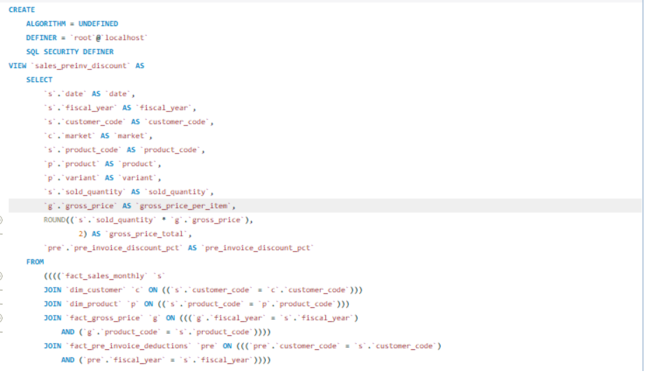

# AtliQ Hardware Insights Using MySQL

## Problem Statement  
AtliQ Hardware is a fast-growing consumer electronics company. However, their reporting was entirely Excel-based, making it inefficient and error-prone.  
To improve business analytics and decision-making, the company transitioned to using SQL for reliable, scalable, and automated reporting.

---

## Project Overview  
This project explores AtliQ Hardware’s finance analytics data using MySQL. The objective is to automate recurring and ad-hoc business reports by leveraging SQL functions, views, procedures, and window functions.

---

## Key Highlights

- Created user-defined functions for calculating fiscal year and quarter  
- Developed stored procedures to automate:
  - Monthly sales reports  
  - Market badge logic (Gold if quantity > 5M, else Silver)  
  - Top 5 markets, customers, and products by net sales  
- Built SQL views for:
  - Pre-invoice and post-invoice deductions  
  - Final net sales  
- Used window functions to generate a report showing:
  - Top 10 markets by percentage net sales for FY 2021

---

## Concepts & Skills Used

- Subqueries  
- Common Table Expressions (CTEs)  
- Views  
- Stored Procedures  
- Window Functions (ROW_NUMBER, RANK, DENSE_RANK)  
- User-Defined Functions (UDFs)

---

## Attached Screenshots

| No. | Screenshot Description | Preview |
|-----|------------------------|---------|
| 01 | Fiscal Year Function |  |
| 02 | Fiscal Quarter Function |  |
| 03 | Monthly Sales Report (Procedure) |  |
| 04 | Market Badge Procedure |  |
| 05 | View: Pre-Invoice Discount |  |
| 06 | View: Post-Invoice Discount |  |
| 07 | View: Net Sales |  |
| 08 | Top 5 Customers Procedure |  |
| 09 | Top 5 Markets Procedure |  |
| 10 | Top 5 Products Procedure |  |
| 11 | Percentage Net Sales by Market (Bar Chart) |  |

---
